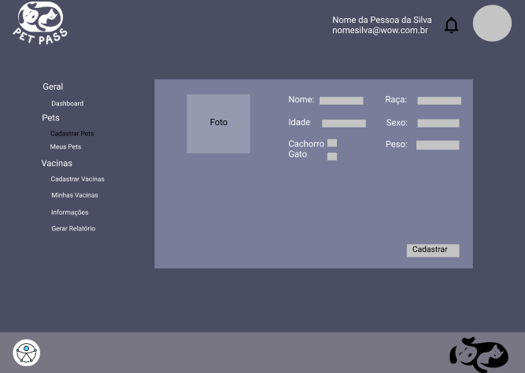
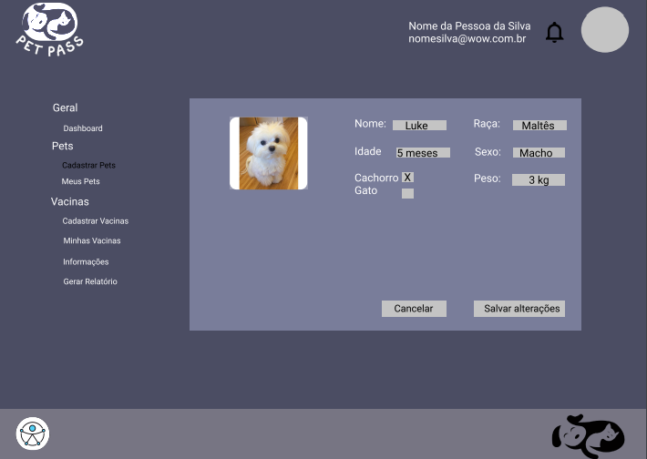
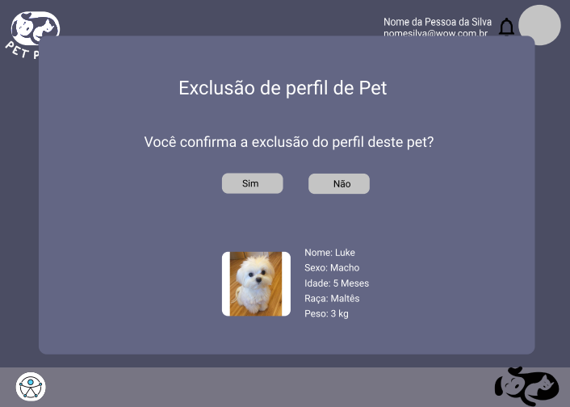
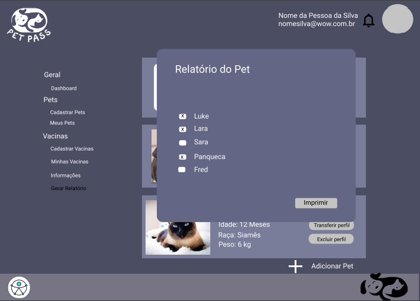

# Projeto de Interface

Pré-requisitos: <a href="2-Especificação do Projeto.md"> Documentação de Especificação</a>

Neste tópico é possível ter uma visão geral da interação do usuário pelas telas e funcionalidades que fazem parte do sistema (wireframes).

Dentre as diversas preocupações com a montagem da interface, foi estabelecido o foco em questões como: agilidade, acessibilidade e usabilidade da aplicação. Desta forma, o projeto tem uma identidade visual padronizada em todas as telas, as quais são projetadas para funcionamento tanto em desktops quanto em dispositivos móveis.

## Diagrama de Fluxo

O diagrama de fluxo é um diagrama que representa um processo de interação entre o usuário e o sistema. Ele mostra o passo a passo de ações a serem realizadas pelo usuário para se chegar a um resultado na aplicação interativa.

A seguir, tem-se o Diagrama de Fluxo contruído para a aplicação do Pet Pass.

## Wireframes

São protótipos utilizados em design de interface para sugerir a estrutura de um site web e seu relacionamentos entre suas páginas. Um wireframe web é uma ilustração semelhante do layout de elementos fundamentais na interface.

A imagem abaixo mostra uma visão geral dos Wireframes da aplicação Pet Pass e seu fluxo de usuário:

 
### Homepage:

Tela de apresentação, que também proporciona ao usuário o conhecimento inicial das funcionalidades e objetivos do projeto.

### Tela de Login:

Tela responsável pela autenticação de clientes cadastrados no sistema. Caso o cliente tenha esquecido a senha de acesso ele será direcionado a tela para recuperação.

### Tela de Cadastro de Usuário:

Tela responsável pelo cadastro de novos usuários no sistema.

### Tela Homepage Interna:

Após a realização do login o usuário é direcionado para a tela de Homepage Interna, na qual ele já está autenticado no sistema. Essa tela apresenta os menus "Pets" e "Vacinas", para cadastro de novos Pets e associação de novas vacinas a eles.

### Tela Editar Perfil de Usuário:

Tela responsável por realizar a edição dos dados cadastrados no perfil do usuário: alteração de nome, e-mail de login e exclusão do perfil (incluindo perfis de Pets associados). 

### Tela Meus Pets:

Tela que inicialmente convida o usuário a realizar o cadastro de um Pet. Após o cadastro é possível observar uma visualização resumida do perfil do Pet, contendo as opções de: visualização (detalhada), edição, exclusão e relatório do pet.

### Tela Cadastrar Pets:

Tela responsável pelo cadastro do perfil Pet, associado ao perfil do usuário, no sistema. Possui os atributos: nome, idade, raça, sexo, peso e a opção de escolha entre gato e cachorro.

### Tela Minhas Vacinas:

Tela que inicialmente convida o usuário a realizar o cadastro de uma vacina, associando-a a um Pet já cadastrado previamente por ele. Após o cadastro é possível observar uma visualização resumida do perfil do Pet relacionado à Vacina cadastrada, contendo as opções de: visualização (detalhada), edição, exclusão de vacina.

### Tela Cadastrar Vacina:

Tela responsável pela associação de uma vacina existente no banco de dados do sistema a um Pet previamente cadastrado, associado ao perfil do usuário, no sistema. Possui os atributos: nome do Pet, descrição da vacina, dose, data de aplicação e idade de aplicação.

### Tela Editar Perfil Pet:

Tela responsável por realizar a edição dos dados cadastrados inicialmente no perfil Pet: alteração de nome, idade, raça, sexo, peso e a opção de escolha entre gato e cachorro.

### Tela Excluir Perfil Pet:

Tela responsável por realizar a exclusão do perfil do Pet associado a um usuário no sistema.

### Tela Gerar Relatório:

Tela utilizada para gerar o relatório de vacinação do Pet selecionados.

