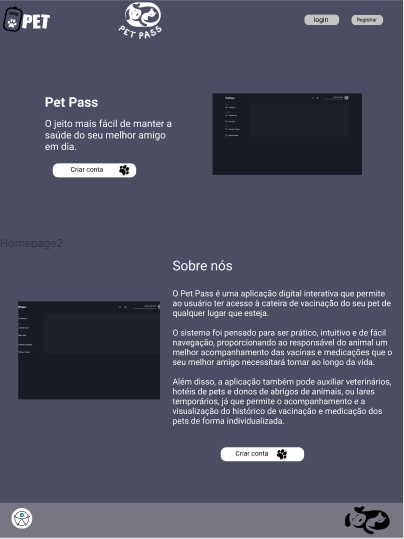
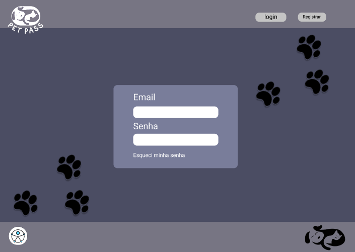
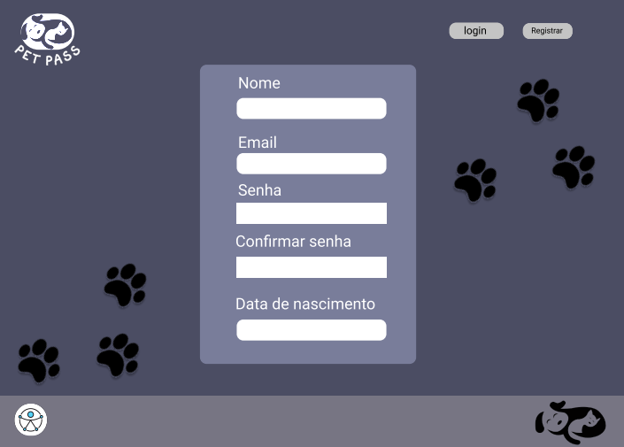
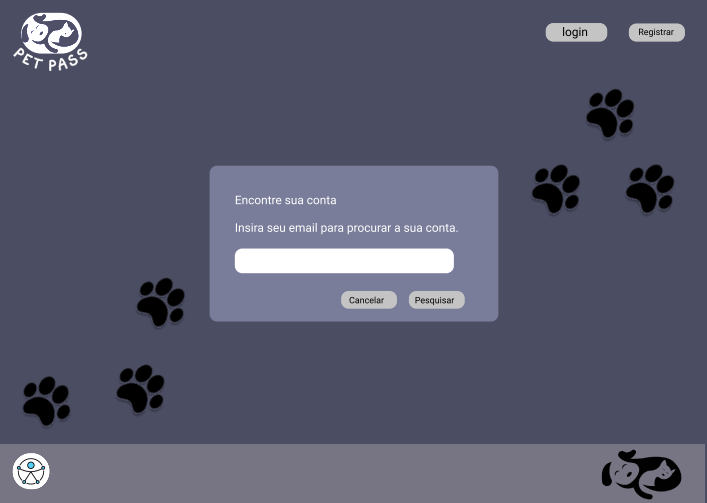
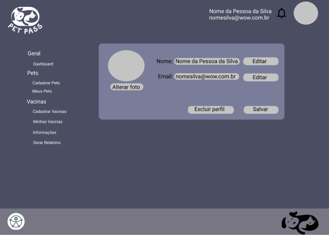
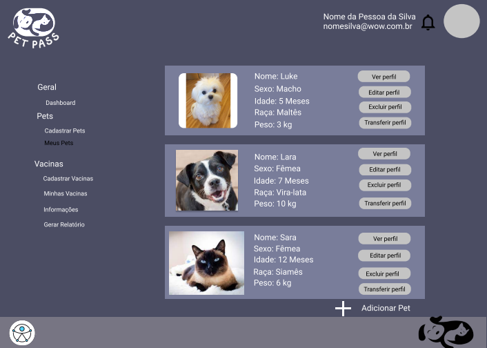
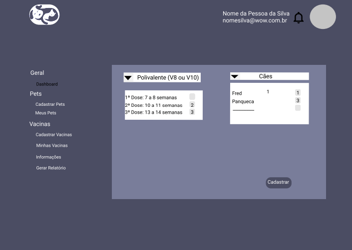
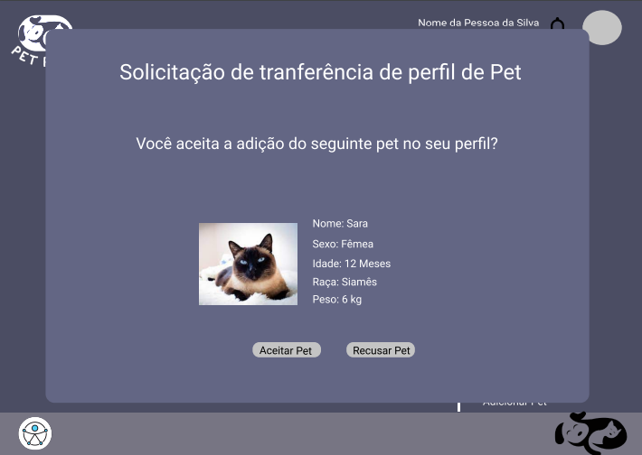
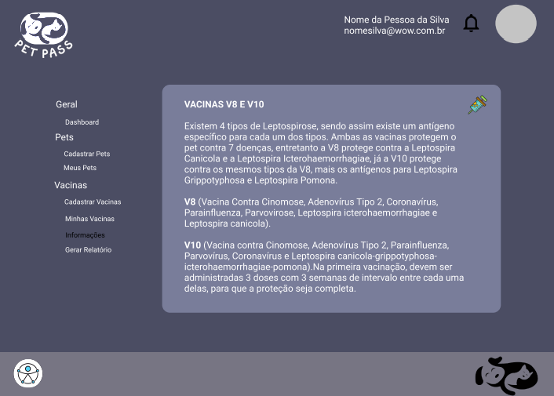

# Projeto de Interface

Pré-requisitos: <a href="2-Especificação do Projeto.md"> Documentação de Especificação</a>

Neste tópico é possível ter uma visão geral da interação do usuário pelas telas e funcionalidades que fazem parte do sistema (wireframes).

Dentre as preocupações para a montagem da interface estabelecemos o foco em questões como agilidade, acessibilidade e usabilidade. Desta forma, o projeto tem uma identidade visual padronizada em todas as telas que são projetadas para funcionamento em desktops e dispositivos móveis.

## Diagrama de Fluxo

O diagrama de fluxo é um diagrama que representa um processo de interação entre o usuário e o sistema. Ele mostra o passo a passo de ações a serem realizadas pelo usuário para se chegar a um resultado na aplicação interativa.

## Wireframes

São protótipos usados em design de interface para sugerir a estrutura de um site web e seu relacionamentos entre suas páginas. Um wireframe web é uma ilustração semelhante do layout de elementos fundamentais na interface.
 
**Homepage:** Tela de apresentação, que também proporciona ao usuário o conhecimento inicial das funcionalidades e objetivos do projeto.

**Tela de Login:** Tela responsável pela autenticação de clientes cadastrados no sistema. Caso o cliente tenha esquecido a senha de acesso ele será direcionado a tela para recuperação.

**Tela de Cadastro de Usuário:** Tela responsável pelo cadastro de novos usuários no sistema.

**Tela de Recuperação de Senha:** Telaresponsável pela execução da rotina de recuperação de senhas de acesso dos usuários.

**Tela Dashboard:** Após a realização do login o usuário é direcionado para a tela de Dashboard. Essa tela possui um vídeo explicativo a fim de auxiliar o cliente a realizar uma melhor navegação pelo sistema.

**Tela Editar Perfil de Usuário:** Telaresponsável por realizar a edição dos dados cadastrados no perfil do usuário: alteração de nome, email de login, inclusão/alteração de foto e exclusão do perfil (incluindo perfis Pets associados). Nessa tela é possível também visualizar notificações do sistema.

**Tela Meus Pets:** Telaque inicialmente convida o usuário a realizar o cadastro de um Pet. Após o cadastro é possível observar um perfil Pet resumido e as opções de visualização (detalhada), edição, exclusão e transferência do Perfil.

**Tela Cadastrar Pets:** Tela responsável pelo cadastro do perfil Pet, associado ao perfil do usuário, no sistema. Possui os atributos: nome, idade, raça, sexo, peso, inclusão de foto e a opção de escolha entre gato e cachorro.

**Tela Selecionar Vacinas Aplicadas:** Tela em que o usuário seleciona, de uma relação de vacinas previamente cadastradas no sistema, quais já foram aplicadas bem como a data em que foi realizada aplicação.

**Tela Editar Perfil Pet:** Telaresponsável por realizar a edição dos dados cadastrados inicialmente no perfil Pet: alteração de nome, idade, raça, sexo, peso, foto e a opção de escolha entre gato e cachorro.

**Tela Excluir Perfil Pet:** Tela responsável por realizar a exclusão do perfil do Pet associado a um usuário no sistema.

**Tela Transferir Perfil Pet:** Tela responsável por realizar uma solicitação de transferência do perfil Pet para a conta de outro usuário cadastrado no sistema.

**Tela de Informações:** Tela que fornece informações a respeito da relação de vacinas que devem ser aplicadas nos Pets.

**Tela Gerar Relatório:** Tela utilizada para gerar o relatório de vacinação dos Pets selecionados.

