# Registro de Testes de Software

Pré-requisitos: <a href="3-Projeto de Interface.md"> Projeto de Interface</a>, <a href="8-Plano de Testes de Software.md"> Plano de Testes de Software</a>

Relatório com as evidências dos testes de software realizados no sistema pela equipe, baseado em um plano de testes pré-definido.

## Avaliação - 1ª rodada:

**Caso teste CT-001**

**Objetivo do teste:**

- Verificar a funcionalidade de criar uma conta no site.

**Resultado do teste:**

A aplicação atendeu ao objetivo do teste;

Foi verificada a possibilidade de cadastrar a conta do usuário no site.

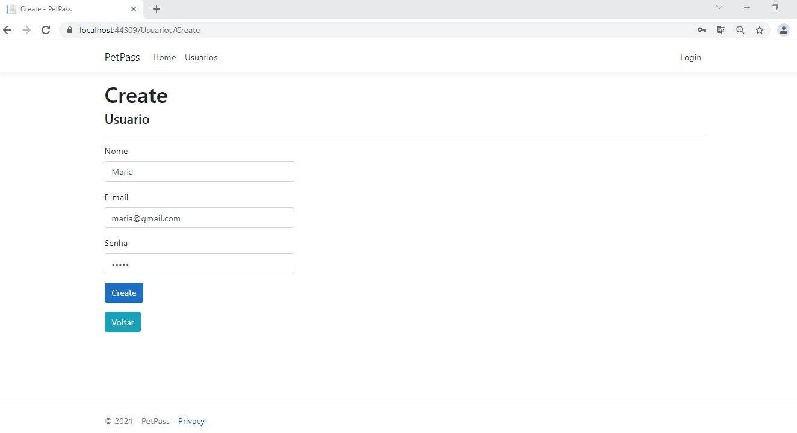

Figura 01 – Print da página Criar Usuário

**Caso teste CT-002**

**Objetivo do teste:**

- Verificar a funcionalidade de login do usuário.

**Resultado do teste:**

Foi possível verificar que o usuário conseguiu logar normalmente em sua conta.

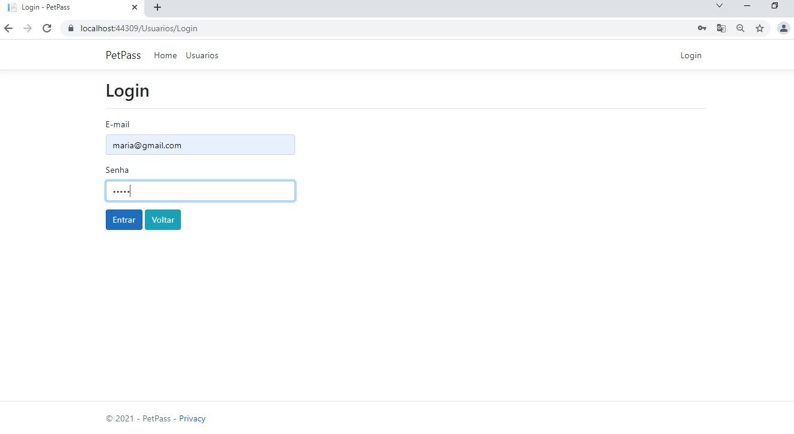

Figura 02 – Print da página Usuário Login

**Caso teste CT-003**

**Objetivo do teste:**

- Verificar a funcionalidade de criar um perfil de pet no site.

**Resultado do teste:**

Foi verificado que por meio do botão "Pets" o usuário consegue cadastrar um perfil de pet contendo várias informações do animal, dentre elas: Nome, raça, idade, data de nascimento e peso.

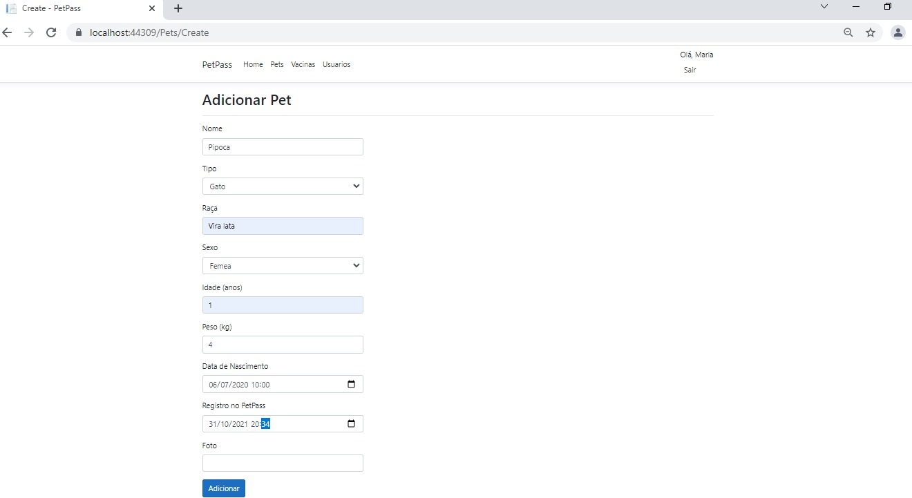

Figura 03 – Print da página Criar Pet

**Caso teste CT-004**

**Objetivo do teste:**

- Verificar a funcionalidade de visualização dos perfis de pet cadastrados em uma conta.

**Resultado do teste:**

Atendeu parcialmente o requisito.

Foi verificado que por meio do botão "Pets" o usuário consegue vizualizar não somente os perfis de pets cadastrados em uma conta mas sim todos os perfis de pet cadastrados no site.

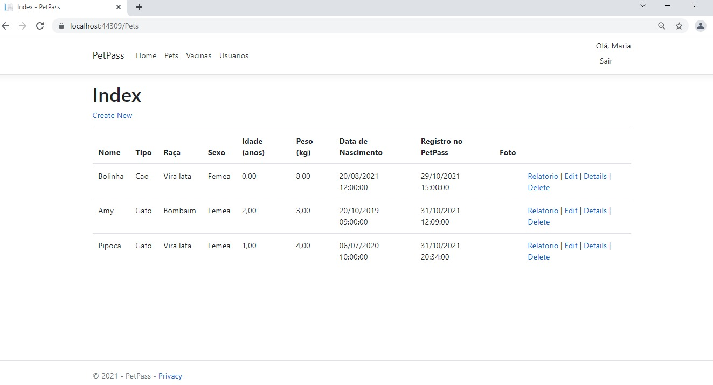

Figura 04 – Print da página Ver Pets

**Caso teste CT-005**

**Objetivo do teste:**

- Verificar a funcionalidade de visualização dos detalhes do perfil de um Pet cadastrado em uma conta.

**Resultado do teste:**

Atendeu corretamente ao que era esperado.

O usuário consegue visualizar o perfil detalhado de um Pet cadastrado em sua conta;

Figura 05 – Print da página Detalhes

**Caso teste CT-006**

**Objetivo do teste:**

- Verificar a funcionalidade de Gerar Relatório do Pet

**Resultado do teste:**

Atendeu parcialmente ao que era esperado.

O relatório apresenta todas as informações do Pet selecionado porém ainda é necessário implantar a opção de impressão.

Figura 06 – Print da página Dados do Pet (Relatório)

**Caso teste CT-007**

**Objetivo do teste:**

- Verificar a funcionalidade de Excluir o perfil de um Pet associado ao usuário.

**Resultado do teste:**

Atendeu parcialmente ao que era esperado.

O usuário consegue excluir o perfil de qualquer Pet cadastrado no sistema.

Após a exclusão o sistema direciona o usuário para a Tela Pets atualizada.

Não há alteração no perfil do usuário após a exclusão.

Figura 07 – Print da página de Excluir Pet (Parte 1)

Figura 08 – Print da página de Excluir Pet (Parte 2)

**Caso teste CT-008**

**Objetivo do teste:**

- Verificar a funcionalidade Excluir conta de usuário.

**Resultado do teste:**

Atendeu parcialmente ao que era esperado.

O usuário consegue excluir qualquer perfil cadastrado no sistema.

Após a exclusão o sistema direciona o usuário para a Tela atualizada.

Não houve alteração na Tela de Pets (ainda não existe vínculo Usuário-Pets) e o usuário permanece logado no sistema mesmo com a exclusão da conta.

Figura 09 – Print da página de Excluir Usuário (Parte 1)

Figura 10 – Print da página de Excluir Usuário (Parte 2)

### Caso teste CT-009

**Objetivo do teste:**

- Verificar o funcionamento do sistema nos principais navegadores da Web.

**Resultado do Teste:**

Funcionalidade ainda não implantada no sistema.

### Caso teste CT-010

**Objetivo do teste:**

- Verificar a funcionalidade de Editar perfil do usuário.

**Resultado do Teste:**

O teste ocorreu de forma parcialmente correta. O usuário consegue logar em sua conta e alterar seus dados de usuário, incluindo login e senha, com a respectiva alteração no banco de dados. Entretanto, o banco de dados ainda está visível para todos os usuários logados, permitindo a um usuário editar o perfil de outro usuário que não seja ele.

Figura 11 – Print da página de Editar Usuário

### Caso teste CT-011

**Objetivo do teste:**

- Verificar a funcionalidade de Editar perfil do pet.

**Resultado do Teste:**

O teste ocorreu de forma parcialmente correta. O usuário consegue logar em sua conta e alterar o perfil de seu pet, com o devido registro da alteração no Banco de Dados da aplicação. Porém, o banco de dados ainda está visível para todos os usuários logados, permitindo a um usuário editar o perfil de um pet que não seja dele.

Figura 12 – Print da página de Editar Pet

### Caso teste CT-012

**Objetivo do teste:**

- Verificar se o sistema está responsivo no acesso pelo smartphone.

**Resultado do Teste:**

Funcionalidade ainda não implantada no sistema.

### Caso teste CT-013

**Objetivo do teste:**

- Verificar a funcionalidade de adicionar uma vacina ao perfil do Pet.

**Resultado do Teste:**

O teste ocorreu de forma correta. O Usuário consegue adicionar uma nova vacina ao perfil de seu pet e ter seu registro atualizado no banco de dados, permitindo-o gerar um relatório já constando a nova vacina registrada.

Figura 13 – Print da página de Adicionar Vacina

Figura 14 – Print da página Relatório do Pet

## Avaliação - 2ª rodada:

**Caso teste CT-001**

**Objetivo do teste:**

- Verificar a funcionalidade de criar uma conta no site.

**Resultado do teste:**

A aplicação atendeu ao objetivo do teste.

O usuário consegue cadastrar sua conta no site com sucesso.

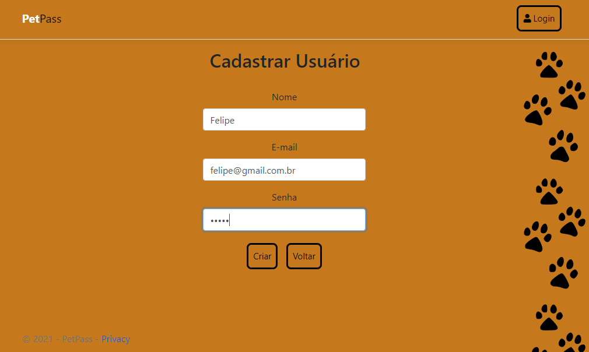

Figura 15 – Print da página Criar Usuário

**Caso teste CT-002**

**Objetivo do teste:**

- Verificar a funcionalidade de login do usuário.

**Resultado do teste:**

A aplicação atendeu ao objetivo do teste.

O usuário cadastrado no sistema consegue logar normalmente na sua conta.

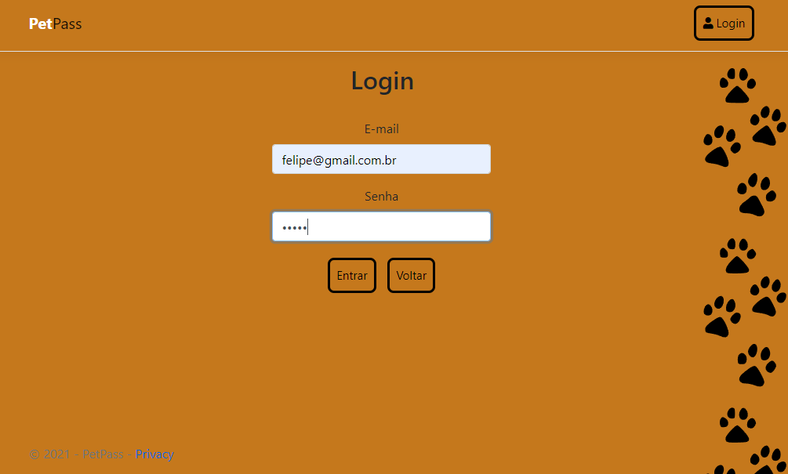

Figura 16 – Print da página Usuário Login

**Caso teste CT-003**

**Objetivo do teste:**

- Verificar a funcionalidade de criar um perfil de pet no site.

**Resultado do teste:**

A aplicação atendeu ao objetivo do teste.

No separador "Pets", ao clicar no botão “Adicionar Pets” o usuário consegue cadastrar um perfil contendo várias informações do animal, dentre elas: Nome, tipo, raça, sexo, idade, data de nascimento e peso.

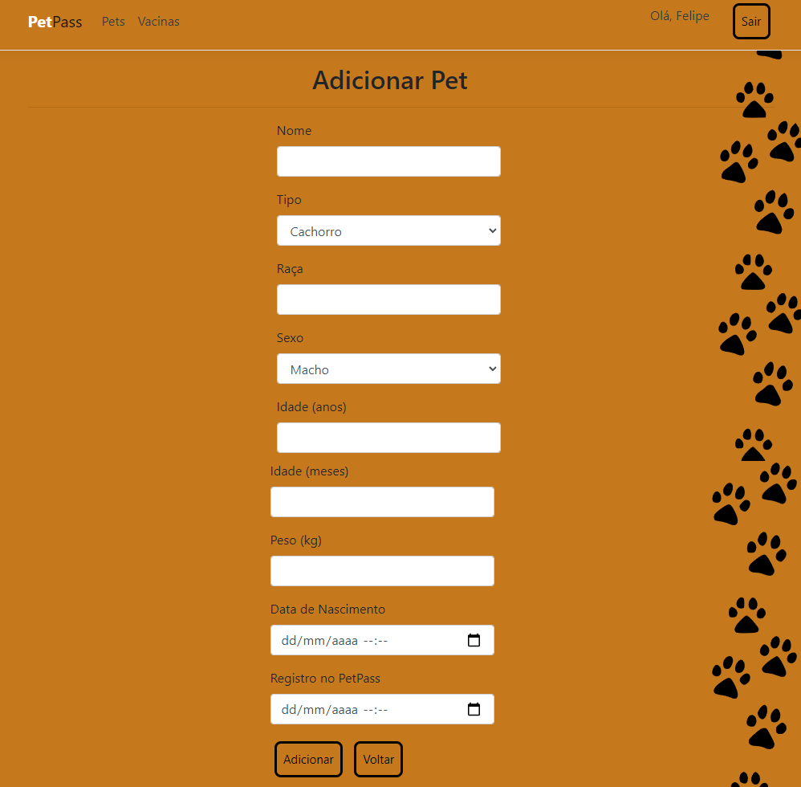

Figura 17 – Print da página Criar Pet

**Caso teste CT-004**

**Objetivo do teste:**

- Verificar a funcionalidade de visualização dos perfis de Pets cadastrados em uma conta.

**Resultado do teste:**

A aplicação atendeu ao objetivo do teste.

Por meio do separador "Pets" o usuário consegue visualizar os perfis dos Pets cadastrados na sua conta.

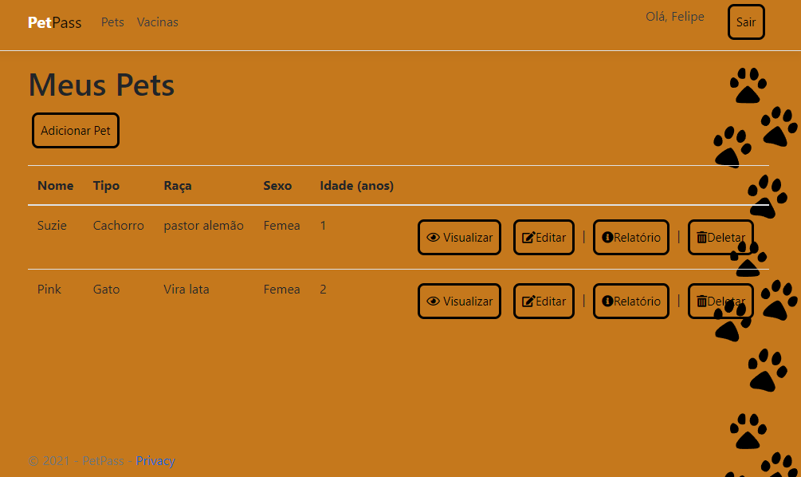

Figura 18 – Print da página Visualizar Pets

**Caso teste CT-005**

**Objetivo do teste:**

- Verificar a funcionalidade de visualização dos detalhes do perfil de um Pet cadastrado em uma conta.

**Resultado do teste:**

A aplicação atendeu ao objetivo do teste.

O usuário consegue visualizar o perfil detalhado de um Pet cadastrado em sua conta.

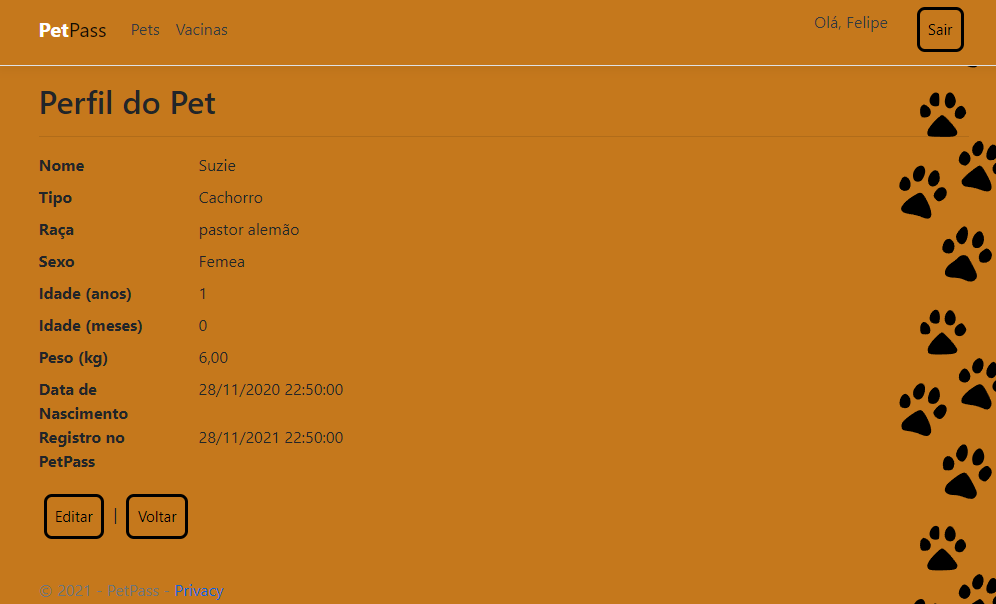

Figura 19 – Print da página Detalhes

**Caso teste CT-006**

**Objetivo do teste:**

- Verificar a funcionalidade de Gerar Relatório do Pet .

**Resultado do teste:**

Atendeu parcialmente ao que era esperado.

O relatório apresenta todas as informações do Pet selecionado porém ainda é necessário implantar a opção de impressão.

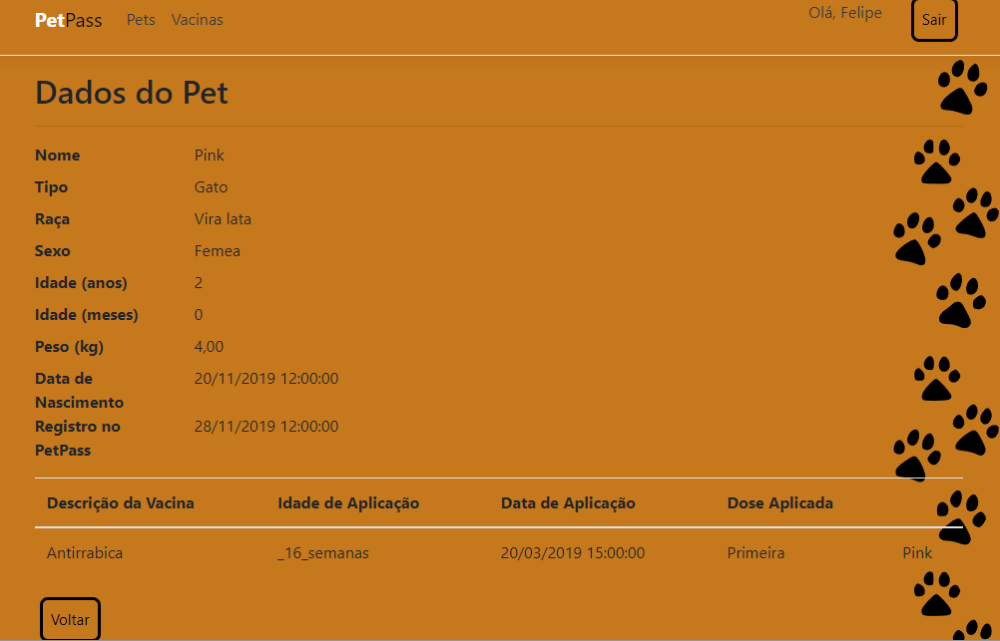

Figura 20 – Print da página Dados do Pet (Relatório)

**Caso teste CT-007**

**Objetivo do teste:**

- Verificar a funcionalidade de Excluir o perfil de um Pet associado ao usuário.

**Resultado do teste:**

A aplicação atendeu ao objetivo do teste.

O usuário consegue excluir o perfil de qualquer Pet cadastrado no sistema e após a exclusão o sistema direciona o usuário para a Tela Pets atualizada.

Não há alteração no perfil do usuário após a exclusão.

Figura 21 – Print da página de Excluir Pet (Parte 1)

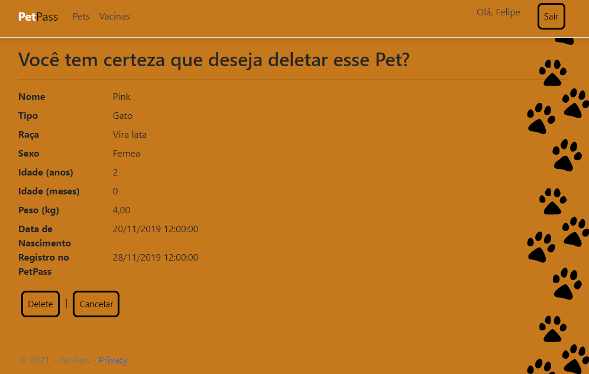

Figura 22 – Print da página de Excluir Pet (Parte 2)

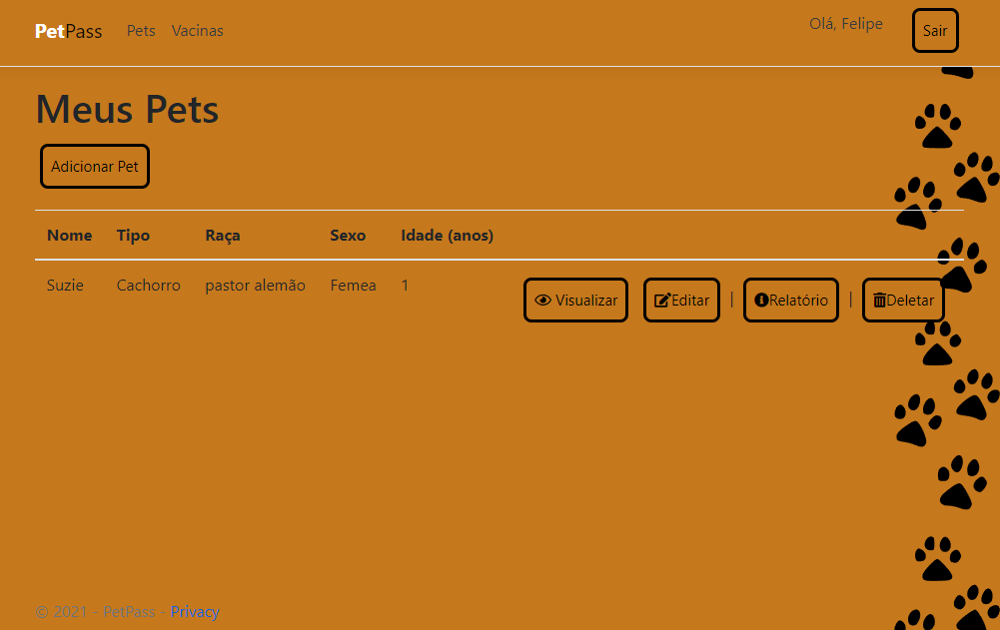

**Caso teste CT-008**

**Objetivo do teste:**

- Verificar a funcionalidade Excluir conta de usuário.

**Resultado do teste:**

Não atendeu ao que era esperado. A funcionalidade ainda não foi desenvolvida, portanto ainda não há a opção de exclusão da conta do usuário.

Figura 23 – Print da tela de perfil do Usuário sem a opção de excluir conta.

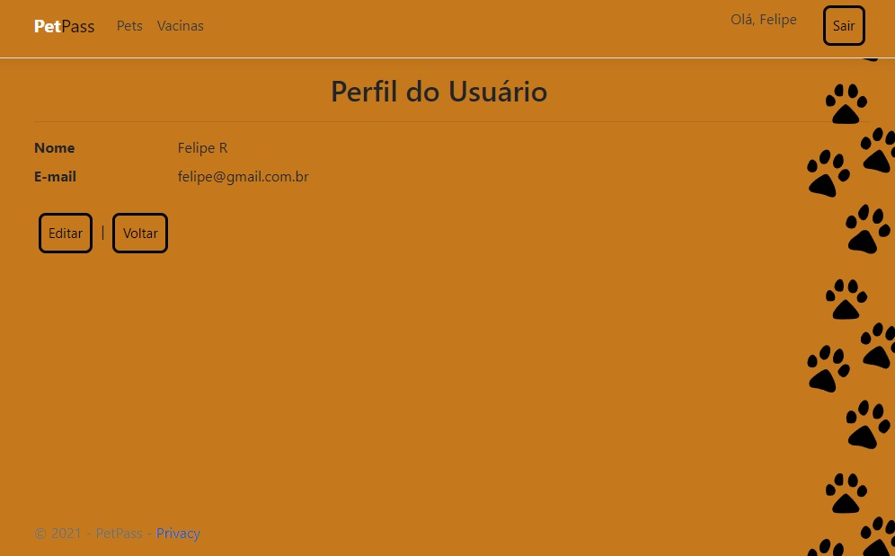

**Caso teste CT-009**

**Objetivo do teste:**

- Verificar o funcionamento do sistema nos principais navegadores da Web.

**Resultado do Teste:**

Funcionalidade ainda não implantada no sistema.

**Caso teste CT-010**

**Objetivo do teste:**

- Verificar a funcionalidade de Editar perfil do usuário.

**Resultado do Teste:**

O teste ocorreu de forma correta. O usuário consegue logar em sua conta e alterar seus dados de usuário, incluindo login e senha, com a respectiva alteração no banco de dados.

Figura 24 – Print da tela de perfil do Usuário com a opção de editar.

Figura 25 – Print da página de Editar Usuário.

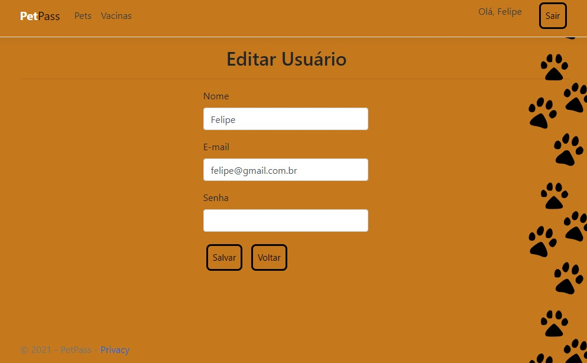

**Caso teste CT-011**

**Objetivo do teste:**

- Verificar a funcionalidade de Editar perfil do pet.

**Resultado do Teste:**

O teste ocorreu de forma correta. O usuário consegue acessar a página de editar dados do pet (nome, tipo de pet, raça, idade, peso, data de nascimento, etc) e salvar as alterações feitas.

Figura 26 – Print da página de Editar dados do Pet

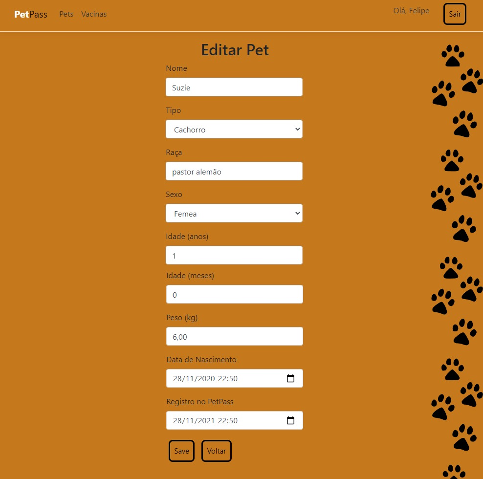

**Caso teste CT-012**

**Objetivo do teste:**

- Verificar se o sistema está responsivo no acesso pelo smartphone.

**Resultado do Teste:**

Cumpriu ao teste. Sistema responsivo conforme a imagem a seguir.

Figura 27 – Print da aplicação na tela de um Samsumg S5

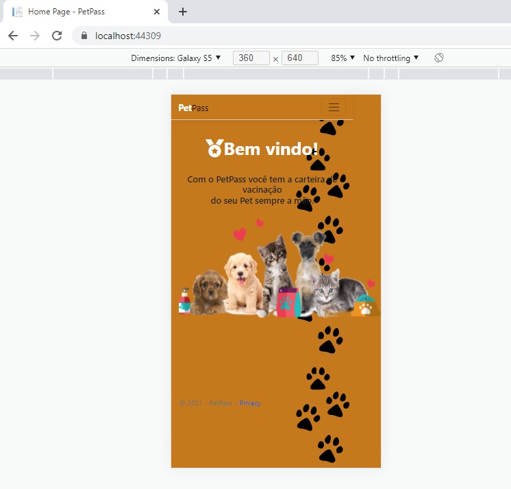

**Caso teste CT-013**

**Objetivo do teste:**

- Verificar a funcionalidade de adicionar uma vacina ao perfil do Pet.

**Resultado do Teste:**

O teste ocorreu de forma correta. O Usuário consegue adicionar uma nova vacina ao perfil de um pet e ter seu registro atualizado no banco de dados, permitindo-o gerar um relatório já constando a nova vacina registrada.

Figura 28 – Print da página de cadastrar vacina.

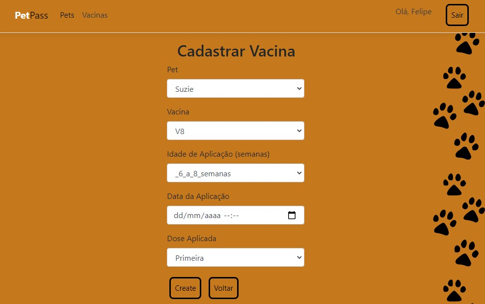
