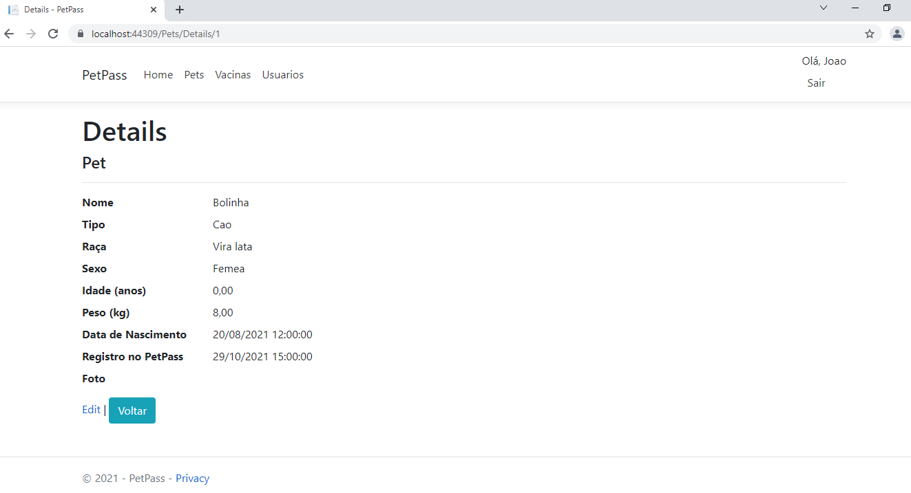
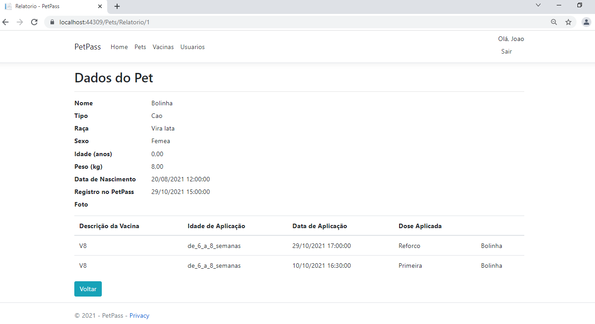
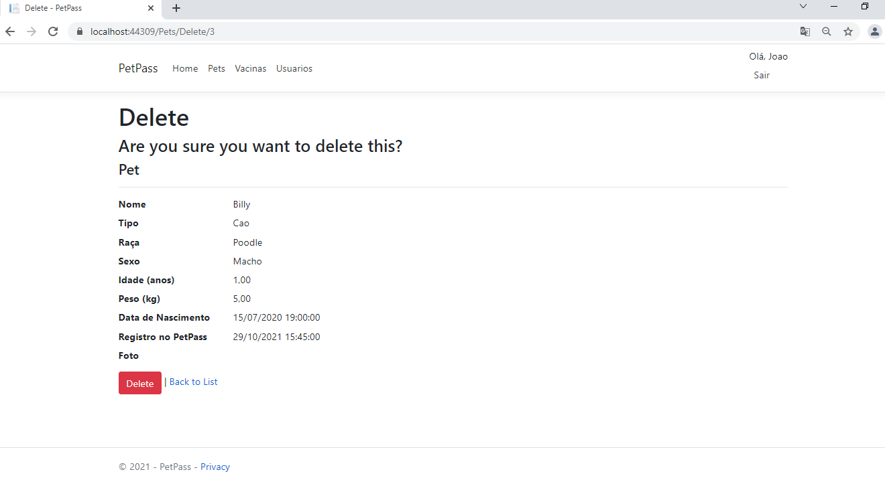
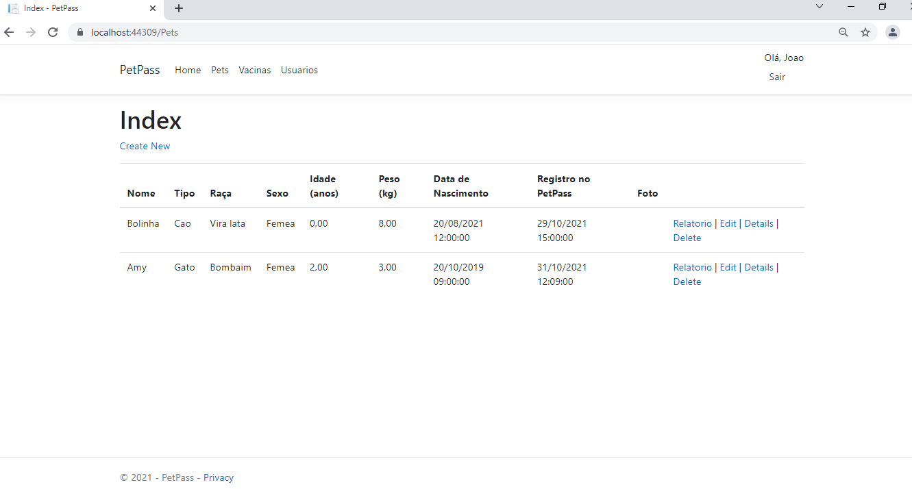
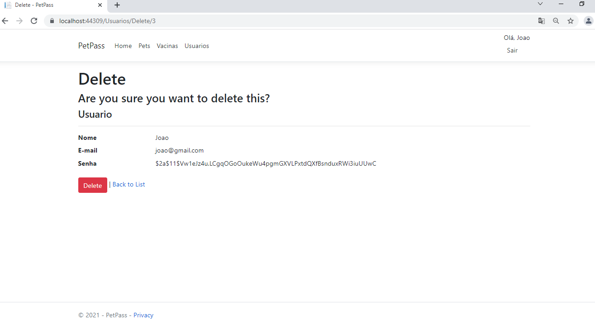
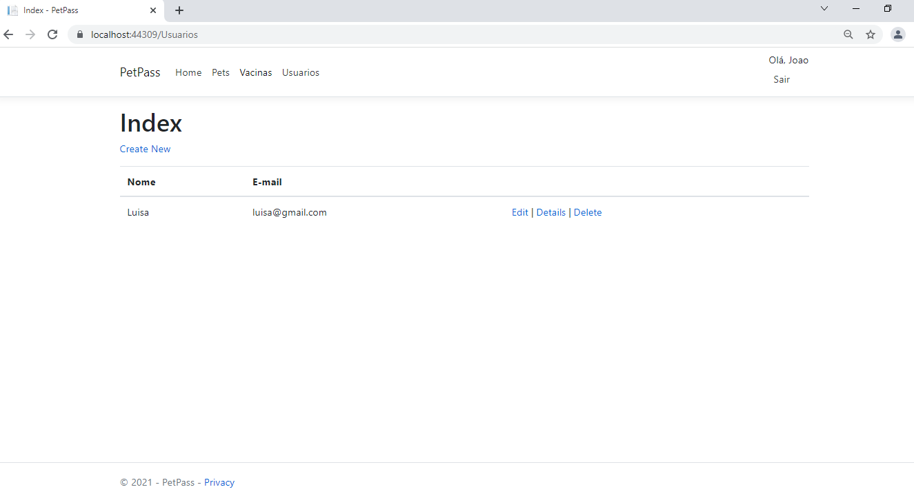

# Registro de Testes de Usabilidade

Após realizar os testes de usabilidade, obtém-se um relatório a partir das análises realizadas. O Registro de Testes de Usabilidade é um relatório que contém as evidências dos testes e relatos dos usuários participantes, baseado no Plano de Testes de Usabilidade desenvolvido para os casos de uso desta etapa.

**Caso teste CT-006**

**Objetivo do teste:**

- Verificar a funcionalidade de visualização dos detalhes do perfil de um Pet cadastrado em uma conta.

**Resultados:**

**Visibilidade do sistema**

A interface do sistema permite a visualização adequada das funcionalidades? Sim

**Navegabilidade**

O sistema é intuitivo e de fácil navegação? Sim

**Padronização de telas**

As telas do sistema são padronizadas e de fácil compreensão? Sim

**Eficiência e flexibilidade de uso**

O sistema se mostrou prático, rápido, intuitivo e de fácil utilização? Sim

**Estética e design**

A interface apresenta uma aparência agradável e minimalista? Não

**Informatividade**

A aplicação apresenta informações sobre como utilizá-la? Não

**Funcionamento durante os testes**

O sistema funcionou adequadamente durante todos os testes? Sim

**Acessibilidade**

A aplicação se mostrou acessível para pessoas com deficiência? Não

**Grau de satisfação do usuário**

Qual sua satisfação com esta aplicação? Muito Bom

**Possibilidade de indicação para terceiros**

Você indicaria esta aplicação para outras pessoas? Sim

Figura xx – Print da página Detalhes

**Caso teste CT-007**

**Objetivo do teste:**

- Verificar a funcionalidade de Gerar Relatório do Pet

**Resultados:**

**Visibilidade do sistema**

A interface do sistema permite a visualização adequada das funcionalidades? Sim

**Navegabilidade**

O sistema é intuitivo e de fácil navegação? Sim

**Padronização de telas**

As telas do sistema são padronizadas e de fácil compreensão? Sim

**Eficiência e flexibilidade de uso**

O sistema se mostrou prático, rápido, intuitivo e de fácil utilização? Sim

**Estética e design**

A interface apresenta uma aparência agradável e minimalista? Não

**Informatividade**

A aplicação apresenta informações sobre como utilizá-la? Não

**Funcionamento durante os testes**

O sistema funcionou adequadamente durante todos os testes? Sim

**Acessibilidade**

A aplicação se mostrou acessível para pessoas com deficiência? Não

**Grau de satisfação do usuário**

Qual sua satisfação com esta aplicação? Bom

**Possibilidade de indicação para terceiros**

Você indicaria esta aplicação para outras pessoas? Sim

Figura xx – Print da página Dados do Pet (Relatório)

**Caso teste CT-008**

**Objetivo do teste:**

- Verificar a funcionalidade de Transferência do perfil do Pet

**Resultados:**

Funcionalidade ainda não implantada no sistema.

**Caso teste CT-009**

**Objetivo do teste:**

- Verificar a funcionalidade de Excluir o perfil de um Pet associado ao usuário.

**Resultados:**

**Visibilidade do sistema**

A interface do sistema permite a visualização adequada das funcionalidades? Sim

**Navegabilidade**

O sistema é intuitivo e de fácil navegação? Sim

**Padronização de telas**

As telas do sistema são padronizadas e de fácil compreensão? Sim

**Eficiência e flexibilidade de uso**

O sistema se mostrou prático, rápido, intuitivo e de fácil utilização? Sim

**Estética e design**

A interface apresenta uma aparência agradável e minimalista? Não

**Informatividade**

A aplicação apresenta informações sobre como utilizá-la? Não

**Funcionamento durante os testes**

O sistema funcionou adequadamente durante todos os testes? Sim

**Acessibilidade**

A aplicação se mostrou acessível para pessoas com deficiência? Não

**Grau de satisfação do usuário**

Qual sua satisfação com esta aplicação? Bom

**Possibilidade de indicação para terceiros**

Você indicaria esta aplicação para outras pessoas? Sim

Figura xx – Print da página de Excluir Pet (Parte 1)

Figura xx – Print da página de Excluir Pet (Parte 2)

**Caso teste CT-010**

**Objetivo do teste:**

- Verificar a funcionalidade Excluir conta de usuário.

**Resultados:**

**Visibilidade do sistema**

A interface do sistema permite a visualização adequada das funcionalidades? Sim

**Navegabilidade**

O sistema é intuitivo e de fácil navegação? Sim

**Padronização de telas**

As telas do sistema são padronizadas e de fácil compreensão? Sim

**Eficiência e flexibilidade de uso**

O sistema se mostrou prático, rápido, intuitivo e de fácil utilização? Sim

**Estética e design**

A interface apresenta uma aparência agradável e minimalista? Não

**Informatividade**

A aplicação apresenta informações sobre como utilizá-la? Não

**Funcionamento durante os testes**

O sistema funcionou adequadamente durante todos os testes? Sim

**Acessibilidade**

A aplicação se mostrou acessível para pessoas com deficiência? Não

**Grau de satisfação do usuário**

Qual sua satisfação com esta aplicação? Bom

**Possibilidade de indicação para terceiros**

Você indicaria esta aplicação para outras pessoas? Sim

Figura xx – Print da página de Excluir Usuário (Parte 1)

)

Figura xx – Print da página de Excluir Usuário (Parte 2)
